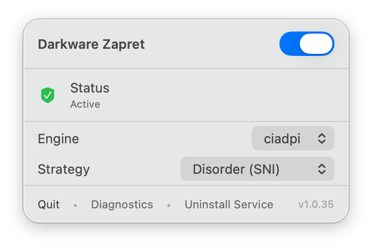

# Darkware Zapret for macOS

**Darkware Zapret** is a native macOS status bar application that wraps the powerful [zapret](https://github.com/bol-van/zapret) DPI bypass tool into a user-friendly, one-click solution.



## Features

- **Native macOS UI**: Clean, modern SwiftUI interface that lives in your menu bar.
- **One-Click Protection**: Instantly toggle DPI bypass on and off.
- **Smart Strategies**: Choose between pre-configured bypass strategies (e.g., specific for YouTube/Discord or generic) directly from the UI.
- **Auto-Start**: Automatically launches and protects your connection on system startup (via LaunchDaemon).
- **Persistent Configuration**: Your strategy settings are saved and persist across updates.
- **Secure**: Uses `sudoers` for privilege escalation, running securely in the background.

## Installation

1. Download the latest `DarkwareZapret_Installer.dmg` from Releases.
2. Open the DMG and drag **Darkware Zapret** to the **Applications** folder.
3. Launch the app.
4. Click **Install Service** in the menu to set up the background daemon (requires Administrator password once).
5. Toggle the switch to **ON**.

## Strategies

- **Split + Disorder (Default)**: Balanced strategy, works for most services including Discord and YouTube.
- **Fake + Split**: More aggressive, attempts to fool DPI with fake packets.
- **Fake Only**: Uses only fake packets.

## Build from Source

Requirements:
- macOS 13.0+
- Xcode 14+ (or Command Line Tools)

```bash
# Clone repository
git clone https://github.com/your-repo/darkware-zapret.git
cd darkware-zapret

# Build release
swift build -c release

# Create App Bundle and DMG
./create_app.sh
```

The resulting `.dmg` will be in the project root.

## Architecture

- **Frontend**: SwiftUI (macOS MenuBarExtra).
- **Backend**: Shell scripts wrapping `tpws` binary from `zapret`.
- **Persistence**: `UserDefaults` for UI state, flat file for `zapret` config injection.

## Credits

- Powered by [zapret](https://github.com/bol-van/zapret) by bol-van.
- Built by Darkware.

## License

MIT License.

## Troubleshooting

### "App is damaged and can't be opened"
Since the app is not signed with an obscure Apple Developer ID (which costs $99/year), macOS puts it in quarantine. To fix this:

1. Open Terminal.
2. Run the following command:
   ```bash
   /usr/bin/xattr -cr /Applications/"darkware zapret.app"
   ```
3. Launch the app again.
